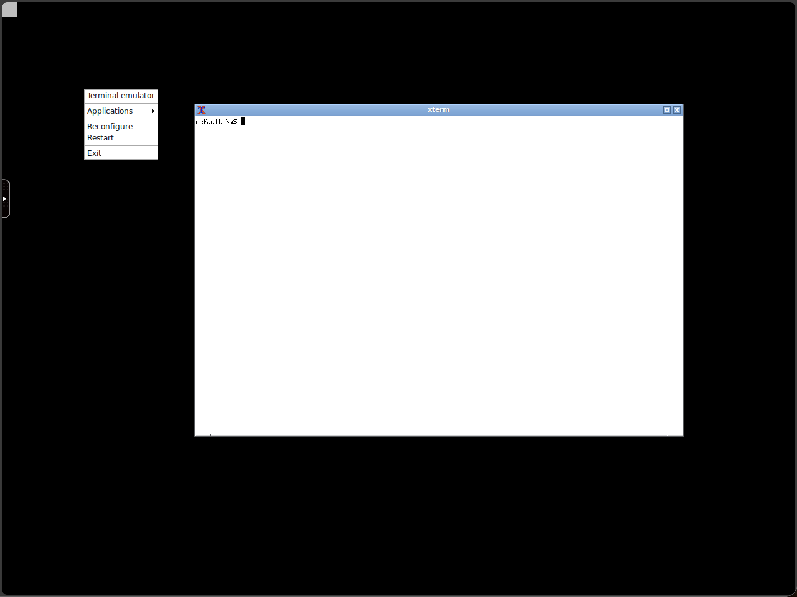

## Features

- minimal image size, approximate only 900MB
- openbox windows manager, as simple as possible
- python3.12 included
- vim, iproute2, etc. tools are included
- no audio, printer, webcam, nvidia, web-browser, mail, etc. keeping everything simple

## Build

Use [docker bake](https://docs.docker.com/build/bake/) to build the multi-arch images:

```bash
docker buildx bake --load
```

## Usage

```bash
docker run --rm -p 6901:6901 -e VNC_PW=password yusiwen/kasm-core-minimal:1.3.4
```

Access [https://localhost:6901](https://localhost:6901) in web browser.

The default usename is `kasm_user`, password is set by `$VNC_PW`

If the container is planned to use network other than bridge, such as macvlan, it must be started as:

```bash
docker run --rm -p 6901:6901 -e VNC_PW=password -e KASM_NO_VETH=1 yusiwen/kasm-core-minimal:1.3.4
```

The desktop environemnt is OpenBox, use mouse right button to call out the system menu.



### systemd Compatible Image

`yusiwen/kasm-core-minimal:1.3.4-systemd` uses systemd as init process in container.

```bash
$ docker run --rm -d --name kasm-core-minimal -e VNC_PW=password -p 6901:6901 --shm-size=512m --privileged -v=/sys/fs/cgroup:/sys/fs/cgroup:rw --ulimit nofile=1048576:1048576 --cgroupns=host --user=root yusiwen/kasm-core-minimal:1.3.4-systemd

$ docker run kasm-core-minimal systemctl status kasmvnc
● kasmvnc.service - KasmVNC Service
     Loaded: loaded (/usr/lib/systemd/system/kasmvnc.service; enabled; preset: enabled)
     Active: active (running) since Tue 2025-09-23 09:11:52 UTC; 28s ago
   Main PID: 33 (vnc_startup.sh)
      Tasks: 13 (limit: 2857)
     Memory: 171.8M ()
        CPU: 3.442s
     CGroup: /system.slice/docker-7c50f0140db44fd09b22f29a13d738addd4a18fc5987c56768b18d9b52d37983.scope/system.slice/kasmvnc.service
             ├─ 33 /bin/bash /dockerstartup/vnc_startup.sh /dockerstartup/kasm_startup.sh
             ├─ 51 /usr/bin/dbus-daemon --syslog --fork --print-pid 4 --print-address 6 --session
             ├─106 /usr/bin/Xvnc :1 -drinode /dev/dri/renderD128 -depth 24 -httpd /usr/share/kasmvnc/www -sslOnly 1 -FrameRate=24 -BlacklistThreshold=0 -FreeKeyMappings -PreferBandwidth -DynamicQualityMin=4 -DynamicQualityMax=7 -DLP_ClipDelay=0 -interface 0.0.0.0 -websocketPort 6901 -BlacklistThreshold 5 -http-header Cross-Origin-Embedder-Policy=require-corp -http-header Cross-Origin-Opener-Policy=same-origin -FrameRate 60 -DynamicQualityMin 7 -WebpVideoQuality -1 -UseIPv4 1 -VideoScaling 2 -AvoidShiftNumLock 0 -geometry 1024x768 -VideoTime 5 -SendPrimary 0 -DynamicQualityMax 8 -AcceptCutText 1 -BlacklistTimeout 10 -KasmPasswordFile /home/kasm-user/.kasmpasswd -ImprovedHextile 1 -fp /usr/share/fonts/X11//Type1 -RawKeyboard 0 -VideoOutTime 3 -UseIPv6 1 -AcceptPointerEvents 1 -QueryConnect 0 -MaxConnectionTime 0 -udpFullFrameFrequency 0 -RectThreads 0 -DLP_ClipTypes chromium/x-web-custom-data,text/html,image/png -DLP_KeyRateLimit 0 -VideoArea 45 -AcceptKeyEvents 1 -IdleTimeout 0 -PublicIP 127.0.0.1 -IgnoreClientSettingsKasm 0 -DLP_Log off -MaxVideoResolution 1920x1080 -AllowOverride AcceptPointerEvents -DisconnectClients 0 -MaxDisconnectionTime 0 -cert /home/kasm-user/.vnc/self.pem -auth /home/kasm-user/.Xauthority -DLP_ClipSendMax 0 -DLP_RegionAllowRelease 0 -CompareFB 2 -DLP_RegionAllowClick 0 -JpegVideoQuality -1 -PrintVideoArea 0 -DLP_ClipAcceptMax 0 -DLP_ClipDelay 0 -Log "*:stdout:100" -MaxIdleTime 0 -AcceptSetDesktopSize 1 -desktop "7c50f0140db4:1 (kasm-user)" -key /home/kasm-user/.vnc/self.pem -TreatLossless 10 -SendCutText 1 -QueryConnectTimeout 10 -rfbauth /home/kasm-user/.vnc/passwd -rfbwait 30000 -rfbport 5901
             ├─123 /usr/bin/openbox --startup "/usr/lib/x86_64-linux-gnu/openbox-autostart OPENBOX"
             ├─125 /dockerstartup/upload_server/kasm_upload_server --ssl --auth-token kasm_user:password --port 4902 --upload_dir /home/kasm-user/Uploads
             ├─127 tail -f /home/kasm-user/.vnc/7c50f0140db4:1.log
             ├─140 stalonetray -f 0
             ├─142 /tmp/staticx-dIEFmd/kasm_upload_server --ssl --auth-token kasm_user:password --port 4902 --upload_dir /home/kasm-user/Uploads
             ├─143 /tmp/staticx-dIEFmd/kasm_upload_server --ssl --auth-token kasm_user:password --port 4902 --upload_dir /home/kasm-user/Uploads
             └─150 sleep 3

Sep 23 09:11:59 7c50f0140db4 kasm_default_profile.sh[134]: ERROR: openbox-xdg-autostart requires PyXDG to be installed
Sep 23 09:11:59 7c50f0140db4 kasm_default_profile.sh[127]:  2025-09-23 09:11:59,464 [DEBUG] Selection: Selection owner change for WM_S0
Sep 23 09:11:59 7c50f0140db4 kasm_default_profile.sh[127]:  2025-09-23 09:11:59,841 [DEBUG] Selection: Selection owner change for _NET_SYSTEM_TRAY_S0
Sep 23 09:12:01 7c50f0140db4 kasm_default_profile.sh[143]:  * Serving Flask app 'kasm_upload_server'
Sep 23 09:12:01 7c50f0140db4 kasm_default_profile.sh[143]:  * Debug mode: off
Sep 23 09:12:01 7c50f0140db4 kasm_default_profile.sh[143]: WARNING: This is a development server. Do not use it in a production deployment. Use a production WSGI server instead.
Sep 23 09:12:01 7c50f0140db4 kasm_default_profile.sh[143]:  * Running on all addresses (0.0.0.0)
Sep 23 09:12:01 7c50f0140db4 kasm_default_profile.sh[143]:  * Running on https://127.0.0.1:4902
Sep 23 09:12:01 7c50f0140db4 kasm_default_profile.sh[143]:  * Running on https://172.17.0.6:4902
Sep 23 09:12:01 7c50f0140db4 kasm_default_profile.sh[143]: Press CTRL+C to quit
```

